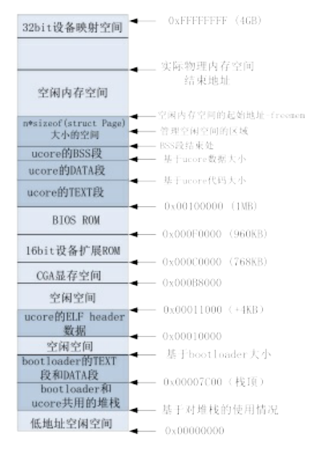

## Prac1：实现first-fit连续物理内存分配算法

* OS初始化函数kern_init中调用pmm_init初始化内存

	```
	void pmm_init(void) {
	    //We need to alloc/free the physical memory (granularity is 4KB or other size). 
	    //So a framework of physical memory manager (struct pmm_manager)is defined in pmm.h
	    //First we should init a physical memory manager(pmm) based on the framework.
	    //Then pmm can alloc/free the physical memory. 
	    //Now the first_fit/best_fit/worst_fit/buddy_system pmm are available.
	    init_pmm_manager();
	
	    // detect physical memory space, reserve already used memory,
	    // then use pmm->init_memmap to create free page list
	    page_init();
	
	    //use pmm->check to verify the correctness of the alloc/free function in a pmm
	    check_alloc_page();
	
	    // create boot_pgdir, an initial page directory(Page Directory Table, PDT)
	    boot_pgdir = boot_alloc_page();
	    memset(boot_pgdir, 0, PGSIZE);
	    boot_cr3 = PADDR(boot_pgdir);
	
	    check_pgdir();
	
	    static_assert(KERNBASE % PTSIZE == 0 && KERNTOP % PTSIZE == 0);
	
	    // recursively insert boot_pgdir in itself
	    // to form a virtual page table at virtual address VPT
	    boot_pgdir[PDX(VPT)] = PADDR(boot_pgdir) | PTE_P | PTE_W;
	
	    // map all physical memory to linear memory with base linear addr KERNBASE
	    //linear_addr KERNBASE~KERNBASE+KMEMSIZE = phy_addr 0~KMEMSIZE
	    //But shouldn't use this map until enable_paging() & gdt_init() finished.
	    boot_map_segment(boot_pgdir, KERNBASE, KMEMSIZE, 0, PTE_W);
	
	    //temporary map: 
	    //virtual_addr 3G~3G+4M = linear_addr 0~4M = linear_addr 3G~3G+4M = phy_addr 0~4M     
	    boot_pgdir[0] = boot_pgdir[PDX(KERNBASE)];
	
	    enable_paging();
	
	    //reload gdt(third time,the last time) to map all physical memory
	    //virtual_addr 0~4G=liear_addr 0~4G
	    //then set kernel stack(ss:esp) in TSS, setup TSS in gdt, load TSS
	    gdt_init();
	
	    //disable the map of virtual_addr 0~4M
	    boot_pgdir[0] = 0;
	
	    //now the basic virtual memory map(see memalyout.h) is established.
	    //check the correctness of the basic virtual memory map.
	    check_boot_pgdir();
	
	    print_pgdir();
	
	}
	```

* pmm_init函数主要完成的工作有：
	- 初始化物理内存页管理器框架pmm_manager
	- 建立空闲的page链表，这样就可以分配以页（4KB）为单位的空闲内存了
	- 检查物理内存页分配算法
	- 为确保切换到分页机制后，代码能够正常执行，先建立一个临时二级页表
	- 建立一一映射关系的二级页表
	- 使能分页机制
	- 重新设置全局段描述符表
	- 取消临时二级页表
	- 检查页表建立是否正确
	- 通过自映射机制完成页表打印输出


* 内存页管理器框架pmm_manager
	```
	// pmm_manager is a physical memory management class. A special pmm manager - XXX_pmm_manager
	// only needs to implement the methods in pmm_manager class, then XXX_pmm_manager can be used
	// by ucore to manage the total physical memory space.
	struct pmm_manager {
	    const char *name;                                 // XXX_pmm_manager's name
	    void (*init)(void);                               // initialize internal description&management data structure
	                                                      // (free block list, number of free block) of XXX_pmm_manager 
	    void (*init_memmap)(struct Page *base, size_t n); // setup description&management data structcure according to
	                                                      // the initial free physical memory space 
	    struct Page *(*alloc_pages)(size_t n);            // allocate >=n pages, depend on the allocation algorithm 
	    void (*free_pages)(struct Page *base, size_t n);  // free >=n pages with "base" addr of Page descriptor structures(memlayout.h)
	    size_t (*nr_free_pages)(void);                    // return the number of free pages 
	    void (*check)(void);                              // check the correctness of XXX_pmm_manager 
	};
	```
	
* 首先调用init_pmm_manager函数初始化pmm_manager

	```
	//init_pmm_manager - initialize a pmm_manager instance
	static void init_pmm_manager(void) {
	    pmm_manager = &default_pmm_manager;
	    cprintf("memory management: %s\n", pmm_manager->name);
	    pmm_manager->init();
	}
	```

	- 使用默认的default_pmm_manager，并调用init方法
	- init方法映射到default_pmm_manager中的default_init方法，在该方法中初始化空闲列表，以备后续使用
	
	```
	/* free_area_t - maintains a doubly linked list to record free (unused) pages */
	typedef struct {
	    list_entry_t free_list;         // the list header
	    unsigned int nr_free;           // # of free pages in this free list
	} free_area_t;
	```

	```
	free_area_t free_area;

	#define free_list (free_area.free_list)
	#define nr_free (free_area.nr_free)
	
	static void default_init(void) {
	    list_init(&free_list);
	    nr_free = 0;
	}
	```

* 接着调用page_init方法，探测物理内存，并建立空闲Page链表

	```
	/* pmm_init - initialize the physical memory management */
	static void page_init(void) {
	    struct e820map *memmap = (struct e820map *)(0x8000 + KERNBASE);
	    uint64_t maxpa = 0;
	
	    cprintf("e820map:\n");
	    int i;
	    for (i = 0; i < memmap->nr_map; i ++) {
	        uint64_t begin = memmap->map[i].addr, end = begin + memmap->map[i].size;
	        cprintf("  memory: %08llx, [%08llx, %08llx], type = %d.\n",
	                memmap->map[i].size, begin, end - 1, memmap->map[i].type);
	        if (memmap->map[i].type == E820_ARM) {
	            if (maxpa < end && begin < KMEMSIZE) {
	                maxpa = end;
	            }
	        }
	    }
	    if (maxpa > KMEMSIZE) {
	        maxpa = KMEMSIZE;
	    }
	
	    extern char end[];
	
	    npage = maxpa / PGSIZE;
	    pages = (struct Page *)ROUNDUP((void *)end, PGSIZE);
	
	    for (i = 0; i < npage; i ++) {
	        SetPageReserved(pages + i);
	    }
	
	    uintptr_t freemem = PADDR((uintptr_t)pages + sizeof(struct Page) * npage);
	
	    for (i = 0; i < memmap->nr_map; i ++) {
	        uint64_t begin = memmap->map[i].addr, end = begin + memmap->map[i].size;
	        if (memmap->map[i].type == E820_ARM) {
	            if (begin < freemem) {
	                begin = freemem;
	            }
	            if (end > KMEMSIZE) {
	                end = KMEMSIZE;
	            }
	            if (begin < end) {
	                begin = ROUNDUP(begin, PGSIZE);
	                end = ROUNDDOWN(end, PGSIZE);
	                if (begin < end) {
	                    init_memmap(pa2page(begin), (end - begin) / PGSIZE);
	                }
	            }
	        }
	    }
	}
	```
	- 实验中通过e820中断获取内存信息。程序在bootloader进入保护模式之前调用这个BIOS中断，把e820映射结构保存在物理地址0x8000处。page_init函数中通过读取0x8000地址获取物理内存信息
	- 系统需要建立相应的数据结构来管理以物理页（按4KB对齐，且大小为4KB的物理内存单元）为最小单位的物理内存。每个物理页可以用一个Page数据结构表示

	```
	/* *
	 * struct Page - Page descriptor structures. Each Page describes one
	 * physical page. In kern/mm/pmm.h, you can find lots of useful functions
	 * that convert Page to other data types, such as phyical address.
	 * */
	struct Page {
	    int ref;                        // page frame's reference counter
	    uint32_t flags;                 // array of flags that describe the status of the page frame
	    unsigned int property;          // the num of free block, used in first fit pm manager
	    list_entry_t page_link;         // free list link
	};
	```
	- 根据内存布局信息找出最大物理内存地址maxpa，由此可得知所需要管理的物理页个数
	```
	npage = maxpa / PGSIZE;
	```
	- 然后可以预估出Page结构所需的内存大小
	```
	sizeof(struct Page) * npage
	```
	- bootloader加载ucore的结束地址记录在全局指针变量end。 把end按页大小为边界去整后，作为管理页级物理内存空间所需的Page结构的内存空间
	```
	pages = (struct Page*)ROUNDUP((void*)end, PAGESIZE);
	```
	- 这时，空闲空间的起始地址为
	```
	uintptr_t freemem = PADDR((uintptr_t)pages + sizeof(struct Page) * npage);
	```
	- 根据空间地址空间，调用init_memmap函数，设置空闲Page属性，并建立空闲Page链表

	```
	static void default_init_memmap(struct Page *base, size_t n) {
	    assert(n > 0);
	    struct Page *p = base;
	    for (; p != base + n; p ++) {
	        assert(PageReserved(p));
	        p->flags = 0;
	        SetPageProperty(p);
	        p->property = 0;
	        set_page_ref(p, 0);
	        list_add_before(&free_list, &(p->page_link));
	    }
	    nr_free += n;
	    //first block
	    base->property = n;
	}
	```

* 建立完空闲Page链表后，调用check_alloc_page函数检查物理内存页分配算法
	- 通过alloc_page和free_page测试分配和释放内存是否正常

	```
	static void check_alloc_page(void) {
	    pmm_manager->check();
	    cprintf("check_alloc_page() succeeded!\n");
	}
	//...
	```

* 分配内存（first-fit）
	
	```
	//alloc_pages - call pmm->alloc_pages to allocate a continuous n*PAGESIZE memory 
	struct Page *alloc_pages(size_t n) {
	    struct Page *page=NULL;
	    bool intr_flag;
	    local_intr_save(intr_flag);
	    {
	        page = pmm_manager->alloc_pages(n);
	    }
	    local_intr_restore(intr_flag);
	    return page;
	}
	```

	```
	static struct Page *default_alloc_pages(size_t n) {
	    assert(n > 0);
	    if (n > nr_free) {
	        return NULL;
	    }
	    list_entry_t *le, *len;
	    le = &free_list;
	
	    while((le=list_next(le)) != &free_list) {
	      struct Page *p = le2page(le, page_link);
	      if(p->property >= n){
	        int i;
	        for(i=0;i<n;i++){
	          len = list_next(le);
	          struct Page *pp = le2page(le, page_link);
	          SetPageReserved(pp);
	          ClearPageProperty(pp);
	          list_del(le);
	          le = len;
	        }
	        if(p->property > n){
	          (le2page(le,page_link))->property = p->property - n;
	        }
	        ClearPageProperty(p);
	        SetPageReserved(p);
	        nr_free -= n;
	        return p;
	      }
	    }
	    return NULL;
	}
	```
	- 从空闲链表头开始查找最小地址，通过list_next找到下一个空闲块元素
	- 通过le2page宏可以根据链表元素获得对应的Page指针p，通过p->property可以了解此空闲块的大小
	- 如果p->property >= n就找到了合适的空闲块，如果<n，则继续查找，直到list_next==&free_list（找完了一遍）
	- 找到后，重新组织空闲块，然后把找到的page返回


* 释放内存
	```
	static void default_free_pages(struct Page *base, size_t n) {
	    assert(n > 0);
	    assert(PageReserved(base));
	
	    list_entry_t *le = &free_list;
	    struct Page * p;
	    while((le=list_next(le)) != &free_list) {
	      p = le2page(le, page_link);
	      if(p>base){
	        break;
	      }
	    }
	    //list_add_before(le, base->page_link);
	    for(p=base;p<base+n;p++){
	      list_add_before(le, &(p->page_link));
	    }
	    base->flags = 0;
	    set_page_ref(base, 0);
	    ClearPageProperty(base);
	    SetPageProperty(base);
	    base->property = n;
	    
	    p = le2page(le,page_link) ;
	    if( base+n == p ){
	      base->property += p->property;
	      p->property = 0;
	    }
	    le = list_prev(&(base->page_link));
	    p = le2page(le, page_link);
	    if(le!=&free_list && p==base-1){
	      while(le!=&free_list){
	        if(p->property){
	          p->property += base->property;
	          base->property = 0;
	          break;
	        }
	        le = list_prev(le);
	        p = le2page(le,page_link);
	      }
	    }
	
	    nr_free += n;
	    return ;
	}
	```
	- default_free_pages实现为default_alloc_pages的逆过程，不过需要考虑空闲块合并的问题


* 当完成物理内存页管理初始化后，计算机系统的内存布局如下图所示

	


## Prac2：实现寻找虚拟地址对应的页表项

#### 段页式管理基本概念

* x86体系结构将内存地址分成三种：逻辑地址（虚地址），线性地址和物理地址
	- 逻辑地址通过段式管理的地址映射可以得到线性地址，线性地址通过页式管理的地址映射得到物理地址

	

	- 页式管理将线性地址分成三个部分：Directory，Table，Offset
	- 一级页表的起始物理地址存放在cr3寄存器中，这个地址必须是一个页对齐的地址，即低12位必须为0

	


* 系统执行中地址映射的四个阶段

	1. bootloader阶段，即从bootloader的start函数开始到kernel的kern_entry之前，其虚拟地址，线性地址，以及物理地址之间的映射一致
		> stage 1: virt addr = linear addr = phy addr
	2. 从kern_entry函数开始，到执行enable_page函数之前，更新了段映射，还没有启动页映射机制。kernel的虚拟起始地址从0xC0100000开始，被bootloader放置在物理内存0x0100000处开始的物理内存中。为确保ucore正确运行，虚拟地址，线性地址，物理地址之间的映射关系为：
		> stage 2: virt addr - 0xc000000 = linear addr = phy addr
	3. 从enable_page函数开始，到执行gdt_init函数之前，启动了页映射机制，但没有更新段映射
		> stage 3: virt addr - 0xc000000 = linear addr = phy addr  # 物理地址在0-4M之内的三者映射关系
		
		> stage 3: virt addr - 0xc000000 = linear addr = phy addr + 0xc000000  # 物理地址在0-4M之外的三者映射关系
	4. 从gdt_init函数开始，第三次更新了段映射，形成了新的段页式映射机制，并且取消了临时映射关系，最终形成了我们期望的虚拟地址，线性地址以及物理地址之间的映射关系：
		> stage 4: virt addr = linear addr = phy addr + 0xc000000


#### 建立虚拟页和物理页帧的地址映射

* 接着上节pmm_init函数，检查完物理内存页分配算法后，调用函数boot_alloc_page为页目录表分配物理内存空间
	- 调用pmm->alloc_pages(1)为页目录表分配一个page
	- 调用page2kva获取page的虚拟地址
	- 设置boot_cr3的值为page的物理地址
	
	```
	//boot_alloc_page - allocate one page using pmm->alloc_pages(1) 
	// return value: the kernel virtual address of this allocated page
	//note: this function is used to get the memory for PDT(Page Directory Table)&PT(Page Table)
	static void *boot_alloc_page(void) {
	    struct Page *p = alloc_page();
	    if (p == NULL) {
	        panic("boot_alloc_page failed.\n");
	    }
	    return page2kva(p);
	}

	static inline void *page2kva(struct Page *page) {
	    return KADDR(page2pa(page));
	}
	```

* 然后，调用boot_map_segment函数建立一一映射关系，即
	
	> virt addr = phy addr + 0xc000000

	- 通过get_pte得到每一个线性地址所在页的页表项地址，然后设置页表项的地址为pa | PTE_P | perm

	```
	//boot_map_segment - setup&enable the paging mechanism
	// parameters
	//  la:   linear address of this memory need to map (after x86 segment map)
	//  size: memory size
	//  pa:   physical address of this memory
	//  perm: permission of this memory  
	static void boot_map_segment(pde_t *pgdir, uintptr_t la, size_t size, uintptr_t pa, uint32_t perm) {
	    assert(PGOFF(la) == PGOFF(pa));
	    size_t n = ROUNDUP(size + PGOFF(la), PGSIZE) / PGSIZE;
	    la = ROUNDDOWN(la, PGSIZE);
	    pa = ROUNDDOWN(pa, PGSIZE);
	    for (; n > 0; n --, la += PGSIZE, pa += PGSIZE) {
	        pte_t *ptep = get_pte(pgdir, la, 1);
	        assert(ptep != NULL);
	        *ptep = pa | PTE_P | perm;
	    }
	}
	```	
	- get_pte:
		- 根据线性地址得到目录表项地址
		- 如果目录表项的内容为空(二级页表不存在)，则分配一个页，得到页物理地址pa，并设置目录表项的值：pa | PTE_U | PTE_W | PTE_P
		- 返回该目录表项内的线性地址所对应的页表项的地址
	
	```
	/* 
	 * MACROs or Functions:
	 *   PDX(la) = the index of page directory entry of VIRTUAL ADDRESS la.
	 *   KADDR(pa) : takes a physical address and returns the corresponding kernel virtual address.
	 *   set_page_ref(page,1) : means the page be referenced by one time
	 *   page2pa(page): get the physical address of memory which this (struct Page *) page  manages
	 *   struct Page * alloc_page() : allocation a page
	 *   memset(void *s, char c, size_t n) : sets the first n bytes of the memory area pointed by s
	 *                                       to the specified value c.
	 * DEFINEs:
	 *   PTE_P           0x001                   // page table/directory entry flags bit : Present
	 *   PTE_W           0x002                   // page table/directory entry flags bit : Writeable
	 *   PTE_U           0x004                   // page table/directory entry flags bit : User can access
	 */

	//get_pte - get pte and return the kernel virtual address of this pte for la
	//        - if the PT contians this pte didn't exist, alloc a page for PT
	// parameter:
	//  pgdir:  the kernel virtual base address of PDT
	//  la:     the linear address need to map
	//  create: a logical value to decide if alloc a page for PT
	// return vaule: the kernel virtual address of this pte
	pte_t *get_pte(pde_t *pgdir, uintptr_t la, bool create) {
	    pde_t *pdep = &pgdir[PDX(la)];
	    if (!(*pdep & PTE_P)) {
	        struct Page *page;
	        if (!create || (page = alloc_page()) == NULL) {
	            return NULL;
	        }
	        set_page_ref(page, 1);
	        uintptr_t pa = page2pa(page);
	        memset(KADDR(pa), 0, PGSIZE);
	        *pdep = pa | PTE_U | PTE_W | PTE_P;
	    }
	    return &((pte_t *)KADDR(PDE_ADDR(*pdep)))[PTX(la)];
	}
	```

* 建立好页表映射后，在调用enable_page函数到执行gdt_init函数之前，内核使用的还是旧的段表映射，即：

	> virt addr = linear addr + 0xC0000000 = phy addr + 2 * 0xC0000000

	- 这段时间，为了保证内核依然能够正常工作，需要让index为0的页目录项的内容等于以索引值为（KERNBASE>>22）的目录表项。 
	- 目前内核大小不超过4M，从0x100000开始编址，这样就只需要让页表在0~4MB的线性地址与KERNBASE ~ KERNBASE+4MB的线性地址获得相同的映射即可，都映射到0~4MB的物理地址空间

	```
	/temporary map: 
    //virtual_addr 3G~3G+4M = linear_addr 0~4M = linear_addr 3G~3G+4M = phy_addr 0~4M     
    boot_pgdir[0] = boot_pgdir[PDX(KERNBASE)];
	```

* 接下来通过调用enable_paging函数使能分页机制。主要做两件事情：
	- 通过lcr3指令把页目录表的起始地址存入CR3寄存器中
	- 通过lcr0指令把cr0中的CR0_PG标志位设置上
	
	```
	static void enable_paging(void) {
	    lcr3(boot_cr3);
	
	    // turn on paging
	    uint32_t cr0 = rcr0();
	    cr0 |= CR0_PE | CR0_PG | CR0_AM | CR0_WP | CR0_NE | CR0_TS | CR0_EM | CR0_MP;
	    cr0 &= ~(CR0_TS | CR0_EM);
	    lcr0(cr0);
	}
	```

* 执行完enable_paging函数后，计算机系统进入了分页模式。但目前还没有建立好完整的段页式映射。
	- ucore在最开始设置的临时的段映射不是简单地对等映射，导致虚拟地址和线性地址不对等
	- 所以，我们需要进一步调整段映射关系，重新设置GDT，建立对等映射
	- 调用gdt_init函数，根据新的gdt全局段描述符表的内容，恢复简单的段对等映射关系，即：
	
	> virt addr = linear addr = phy addr + 0xC000000

	```
	/* gdt_init - initialize the default GDT and TSS */
	static void gdt_init(void) {
	    // set boot kernel stack and default SS0
	    load_esp0((uintptr_t)bootstacktop);
	    ts.ts_ss0 = KERNEL_DS;
	
	    // initialize the TSS filed of the gdt
	    gdt[SEG_TSS] = SEGTSS(STS_T32A, (uintptr_t)&ts, sizeof(ts), DPL_KERNEL);
	
	    // reload all segment registers
	    lgdt(&gdt_pd);
	
	    // load the TSS
	    ltr(GD_TSS);
	}
	```

* 执行完gdt_init后，新的段页式映射就建立好了。这时，上面设置的0-4M的线性地址与物理地址的映射关系已经没有用了，执行下面取消操作：
	
	```
	 //disable the map of virtual_addr 0~4M
    boot_pgdir[0] = 0;
	```

## Prac3：释放某虚拟地址所在的页并取消对应二级页表项的映射

* page_remove函数提供了删除一个线性地址所对应的页的功能
	
	```
	//page_remove - free an Page which is related linear address la and has an validated pte
	void page_remove(pde_t *pgdir, uintptr_t la) {
	    pte_t *ptep = get_pte(pgdir, la, 0);
	    if (ptep != NULL) {
	        page_remove_pte(pgdir, la, ptep);
	    }
	}
	```
	
	- 首先根据线性地址获取页表项地址
	- 如果该页表项存在，调用page_remove_pte函数清除除该页表项以及所对应页的内容

* page_remove_pte:
	- 如果页表项存在，获取页表项对应的页
	- 递减页的引入计数，如果页的引用为0，释放该页
	- 清空页表项内容
	- 更新tlb

	```
	 /* check if ptep is valid, and tlb must be manually updated if mapping is updated
	 *
	 * Some Useful MACROs and DEFINEs, you can use them in below implementation.
	 * MACROs or Functions:
	 *   struct Page *page pte2page(*ptep): get the according page from the value of a ptep
	 *   free_page : free a page
	 *   page_ref_dec(page) : decrease page->ref. NOTICE: ff page->ref == 0 , then this page should be free.
	 *   tlb_invalidate(pde_t *pgdir, uintptr_t la) : Invalidate a TLB entry, but only if the page tables being
	 *                        edited are the ones currently in use by the processor.
	 * DEFINEs:
	 *   PTE_P           0x001                   // page table/directory entry flags bit : Present
	 */
    
	//page_remove_pte - free an Page sturct which is related linear address la
	//                - and clean(invalidate) pte which is related linear address la
	//note: PT is changed, so the TLB need to be invalidate 
	static inline void page_remove_pte(pde_t *pgdir, uintptr_t la, pte_t *ptep) {
	    if (*ptep & PTE_P) {
	        struct Page *page = pte2page(*ptep);
	        if (page_ref_dec(page) == 0) {
	            free_page(page);
	        }
	        *ptep = 0;
	        tlb_invalidate(pgdir, la);
	    }
	}
	```

	```
	//free_pages - call pmm->free_pages to free a continuous n*PAGESIZE memory 
	void free_pages(struct Page *base, size_t n) {
	    bool intr_flag;
	    local_intr_save(intr_flag);
	    {
	        pmm_manager->free_pages(base, n);
	    }
	    local_intr_restore(intr_flag);
	}
	```