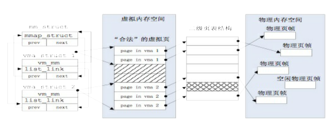
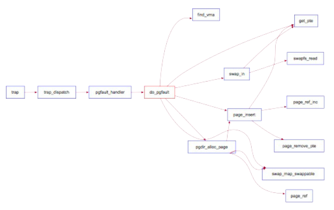
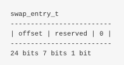

## 虚拟内存管理

#### 基本原理概述

* 虚拟内存
	- 虚拟内存即程序员或CPU“看到”的内存
	- 虚拟内存单元不一定有实际的物理内存单元对应，即实际的物理内存单元可能不存在
	- 虚拟内存单元和对应物理内存单元，两者的地址一般是不对等的
	- 通过操作系统的某种内存映射可建立虚拟内存与物理内存的对应关系


* 虚拟内存的作用
	- 使用分页机制，实现了内存地址虚拟化，这样就可以通过设置页表项来限定软件运行时的访问空间，确保软件运行不越界，完成内存访问保护的功能
	- 按需分页；通过页换人换出技术，把不经常访问的数据的内存写到硬盘上，可以让更多的程序在内存中并发运行


#### 虚拟内存执行流程概述

* 初始化
	- 首先需要调用pmm_init函数初始化物理内存，接着调用pic_init和idt_init完成中断和异常的初始化
	- vmm_init用于检查，物理内存与虚拟内存的映射关系是否正确建立。 当系统访问合法虚拟页时，会因为没有虚实地址映射而产生访问异常，触发缺页异常。 do_pagefault函数会申请一个空闲物理页，并建立好虚实映射关系。
	- ide_init完成对于页换入换出的硬盘（swap分区）的初始化工作
	- swap_init函数首先建立swap_manager，完成页面替换过程的主要功能模块，包含页面置换算法的实现。 然后，进一步调用执行check_swap函数在内核中分配一些页，模拟对这些页的访问，触发页访问异常。 这时，do_pgfault会调用swap_map_swappable函数来查询这些页的访问情况并间接实现页面置换算法的相关函数，把“不常用”的页换出到磁盘上


* 虚存管理总体框架
	1. 完成初始化虚拟内存管理机制：IDE硬盘读写，缺页异常处理
	2. 设置虚拟页空间和物理页帧空间，表述不在物理内存中的“合法”虚拟页
	3. 完善建立页表映射，页访问异常处理操作等函数实现
	4. 执行访存测试，查看建立的页表项是否能够正确完成虚实地址映射
	5. 执行访存测试，查看是否正确描述了虚拟内存页在物理内存中还是在硬盘上
	6. 执行访存测试，查看是否能够正确把虚拟内存页在物理内存和硬盘之间进行传递
	7. 执行访存测试，查看是否正确实现了页面替换算法


* 关键数据结构
	-  Ucore通过建立mm_struct和vma_struct数据结构，描述不在内存中的“合法“虚拟页
	-  当访问内存产生page fault异常时，可获得访问的内存的方式以及具体的虚拟内存地址。 这样，ucore可以查询此地址，看是否属于vma_struct结构中描述的合法地址范围。

	

	```
	// the virtual continuous memory area(vma)
	struct vma_struct {
	    struct mm_struct *vm_mm; // the set of vma using the same PDT 
	    uintptr_t vm_start;      //    start addr of vma    
	    uintptr_t vm_end;        // end addr of vma
	    uint32_t vm_flags;       // flags of vma
	    list_entry_t list_link;  // linear list link which sorted by start addr of vma
	};
	```

	```
	// the control struct for a set of vma using the same PDT
	struct mm_struct {
	    list_entry_t mmap_list;        // linear list link which sorted by start addr of vma
	    struct vma_struct *mmap_cache; // current accessed vma, used for speed purpose
	    pde_t *pgdir;                  // the PDT of these vma
	    int map_count;                 // the count of these vma
	    void *sm_priv;                   // the private data for swap manager
	};
	```


* 虚拟内存初始化
	- vmm_init函数初始化虚拟内存管理框架，并检查映射是否建立成功
	
	```
	// vmm_init - initialize virtual memory management
	//          - now just call check_vmm to check correctness of vmm
	void
	vmm_init(void) {
	    check_vmm();
	}
	
	// check_vmm - check correctness of vmm
	static void check_vmm(void) {
	    size_t nr_free_pages_store = nr_free_pages();
	    
	    check_vma_struct();
	    check_pgfault();
	
	    assert(nr_free_pages_store == nr_free_pages());
	
	    cprintf("check_vmm() succeeded.\n");
	}
	```	

	- check_vma_struct函数，建立虚存映射，并检查
	- check_pgfault函数，测试内存访问，触发page fault，并检查内存映射是否成功


* check_vma_struct
	- 调用函数mm_create分配并初始化mm_struct

	```
	// mm_create -  alloc a mm_struct & initialize it.
	struct mm_struct *mm_create(void) {
	    struct mm_struct *mm = kmalloc(sizeof(struct mm_struct));
	
	    if (mm != NULL) {
	        list_init(&(mm->mmap_list));
	        mm->mmap_cache = NULL;
	        mm->pgdir = NULL;
	        mm->map_count = 0;
	
	        if (swap_init_ok) swap_init_mm(mm);
	        else mm->sm_priv = NULL;
	    }
	    return mm;
	}
	```
	- vma_create函数根据输入参数vm_start，vm_end，vm_flags来创建并初始化描述一个虚拟内存空间的vma_struct结构变量
	```
	// vma_create - alloc a vma_struct & initialize it. (addr range: vm_start~vm_end)
	struct vma_struct *vma_create(uintptr_t vm_start, uintptr_t vm_end, uint32_t vm_flags) {
	    struct vma_struct *vma = kmalloc(sizeof(struct vma_struct));
	
	    if (vma != NULL) {
	        vma->vm_start = vm_start;
	        vma->vm_end = vm_end;
	        vma->vm_flags = vm_flags;
	    }
	    return vma;
	}
	```
	- insert_vma_struct函数完成把一个vma变量按照其空间位置[vma->vm_start, vma->vm_end]从小到大的顺序插入到所属的mm变量中的mmap_list双向链表中
	```
	// insert_vma_struct -insert vma in mm's list link
	void insert_vma_struct(struct mm_struct *mm, struct vma_struct *vma) {
	    assert(vma->vm_start < vma->vm_end);
	    list_entry_t *list = &(mm->mmap_list);
	    list_entry_t *le_prev = list, *le_next;
	
	        list_entry_t *le = list;
	        while ((le = list_next(le)) != list) {
	            struct vma_struct *mmap_prev = le2vma(le, list_link);
	            if (mmap_prev->vm_start > vma->vm_start) {
	                break;
	            }
	            le_prev = le;
	        }
	
	    le_next = list_next(le_prev);
	
	    /* check overlap */
	    if (le_prev != list) {
	        check_vma_overlap(le2vma(le_prev, list_link), vma);
	    }
	    if (le_next != list) {
	        check_vma_overlap(vma, le2vma(le_next, list_link));
	    }
	
	    vma->vm_mm = mm;
	    list_add_after(le_prev, &(vma->list_link));
	
	    mm->map_count ++;
	}
	```
	- find_vma根据输入参数addr和mm变量，查找mm变量中的mmap_list双向链表中某个vma包含此addr
	```
	// find_vma - find a vma  (vma->vm_start <= addr <= vma_vm_end)
	struct vma_struct *find_vma(struct mm_struct *mm, uintptr_t addr) {
	    struct vma_struct *vma = NULL;
	    if (mm != NULL) {
	        vma = mm->mmap_cache;
	        if (!(vma != NULL && vma->vm_start <= addr && vma->vm_end > addr)) {
	                bool found = 0;
	                list_entry_t *list = &(mm->mmap_list), *le = list;
	                while ((le = list_next(le)) != list) {
	                    vma = le2vma(le, list_link);
	                    if (vma->vm_start<=addr && addr < vma->vm_end) {
	                        found = 1;
	                        break;
	                    }
	                }
	                if (!found) {
	                    vma = NULL;
	                }
	        }
	        if (vma != NULL) {
	            mm->mmap_cache = vma;
	        }
	    }
	    return vma;
	}
	```


#### Page Fault异常处理

* Page Fault异常
	- 产生页访问异常的原因主要有：
		- 目标页帧不存在：页表项全为0，即该线性地址与物理地址尚未建立映射或者已经撤销
	 	- 相应的物理页帧不在内存中：页表项非空，但present位为0。 物理页帧在swap分区或磁盘文件上
	 	- 不满足访问权限：低权限的程序试图访问高权限的地址空间，或者试图写只读页面
	- 出现异常后，CPU会把产生异常的线性地址存储在CR2中，并且把表示页访问异常类型的值（页访问异常码，errorCode）保存在中断栈中
	- 中断服务处理流程：
	> trap -> trap_dispatch -> pgfault_handler -> do_pgfault


* do_pgfault
	- 根据CR2中的异常物理地址和errorCode的错误类型来检查此地址是否在某个vma的地址范围内，以及是否满足正确的读写权限
	- 如果地址在范围内并且权限正确，即被认为是一次合法访问，但没有建立虚实映射关系。 所以需要分配一个空闲的内存页，并修改页表完成虚地址到物理地址的映射，刷新TLB，然后调用iret中断，返回到产生页访问异常的指令 处重新执行此指令。
	- 如果地址不在某个vma范围内，则认为是一个非法访问

	


	```
	/* do_pgfault - interrupt handler to process the page fault execption
	 * @mm         : the control struct for a set of vma using the same PDT
	 * @error_code : the error code recorded in trapframe->tf_err which is setted by x86 hardware
	 * @addr       : the addr which causes a memory access exception, (the contents of the CR2 register)
	 *
	 * CALL GRAPH: trap--> trap_dispatch-->pgfault_handler-->do_pgfault
	 * The processor provides ucore's do_pgfault function with two items of information to aid in diagnosing
	 * the exception and recovering from it.
	 *   (1) The contents of the CR2 register. The processor loads the CR2 register with the
	 *       32-bit linear address that generated the exception. The do_pgfault fun can
	 *       use this address to locate the corresponding page directory and page-table
	 *       entries.
	 *   (2) An error code on the kernel stack. The error code for a page fault has a format different from
	 *       that for other exceptions. The error code tells the exception handler three things:
	 *         -- The P flag   (bit 0) indicates whether the exception was due to a not-present page (0)
	 *            or to either an access rights violation or the use of a reserved bit (1).
	 *         -- The W/R flag (bit 1) indicates whether the memory access that caused the exception
	 *            was a read (0) or write (1).
	 *         -- The U/S flag (bit 2) indicates whether the processor was executing at user mode (1)
	 *            or supervisor mode (0) at the time of the exception.
	 */
	int do_pgfault(struct mm_struct *mm, uint32_t error_code, uintptr_t addr) {
	    int ret = -E_INVAL;
	    //try to find a vma which include addr
	    struct vma_struct *vma = find_vma(mm, addr);
	
	    pgfault_num++;
	    //If the addr is in the range of a mm's vma?
	    if (vma == NULL || vma->vm_start > addr) {
	        cprintf("not valid addr %x, and  can not find it in vma\n", addr);
	        goto failed;
	    }
	    //check the error_code
	    switch (error_code & 3) {
	    default:
	            /* error code flag : default is 3 ( W/R=1, P=1): write, present */
	    case 2: /* error code flag : (W/R=1, P=0): write, not present */
	        if (!(vma->vm_flags & VM_WRITE)) {
	            cprintf("do_pgfault failed: error code flag = write AND not present, but the addr's vma cannot write\n");
	            goto failed;
	        }
	        break;
	    case 1: /* error code flag : (W/R=0, P=1): read, present */
	        cprintf("do_pgfault failed: error code flag = read AND present\n");
	        goto failed;
	    case 0: /* error code flag : (W/R=0, P=0): read, not present */
	        if (!(vma->vm_flags & (VM_READ | VM_EXEC))) {
	            cprintf("do_pgfault failed: error code flag = read AND not present, but the addr's vma cannot read or exec\n");
	            goto failed;
	        }
	    }
	    /* IF (write an existed addr ) OR
	     *    (write an non_existed addr && addr is writable) OR
	     *    (read  an non_existed addr && addr is readable)
	     * THEN
	     *    continue process
	     */
	    uint32_t perm = PTE_U;
	    if (vma->vm_flags & VM_WRITE) {
	        perm |= PTE_W;
	    }
	    addr = ROUNDDOWN(addr, PGSIZE);
	
	    ret = -E_NO_MEM;
	
	    pte_t *ptep=NULL;
	    /*LAB3 EXERCISE 1: YOUR CODE
	    * Maybe you want help comment, BELOW comments can help you finish the code
	    *
	    * Some Useful MACROs and DEFINEs, you can use them in below implementation.
	    * MACROs or Functions:
	    *   get_pte : get an pte and return the kernel virtual address of this pte for la
	    *             if the PT contians this pte didn't exist, alloc a page for PT (notice the 3th parameter '1')
	    *   pgdir_alloc_page : call alloc_page & page_insert functions to allocate a page size memory & setup
	    *             an addr map pa<--->la with linear address la and the PDT pgdir
	    * DEFINES:
	    *   VM_WRITE  : If vma->vm_flags & VM_WRITE == 1/0, then the vma is writable/non writable
	    *   PTE_W           0x002                   // page table/directory entry flags bit : Writeable
	    *   PTE_U           0x004                   // page table/directory entry flags bit : User can access
	    * VARIABLES:
	    *   mm->pgdir : the PDT of these vma
	    *
	    */

	    // try to find a pte, if pte's PT(Page Table) isn't existed, then create a PT.
	    // (notice the 3th parameter '1')
	    if ((ptep = get_pte(mm->pgdir, addr, 1)) == NULL) {
	        cprintf("get_pte in do_pgfault failed\n");
	        goto failed;
	    }
	    
	    if (*ptep == 0) { // if the phy addr isn't exist, then alloc a page & map the phy addr with logical addr
	        if (pgdir_alloc_page(mm->pgdir, addr, perm) == NULL) {
	            cprintf("pgdir_alloc_page in do_pgfault failed\n");
	            goto failed;
	        }
	    }
	    else { // if this pte is a swap entry, then load data from disk to a page with phy addr
	           // and call page_insert to map the phy addr with logical addr
	        if(swap_init_ok) {
	            struct Page *page=NULL;
	            if ((ret = swap_in(mm, addr, &page)) != 0) {
	                cprintf("swap_in in do_pgfault failed\n");
	                goto failed;
	            }    
	            page_insert(mm->pgdir, page, addr, perm);
	            swap_map_swappable(mm, addr, page, 1);
	            page->pra_vaddr = addr;
	        }
	        else {
	            cprintf("no swap_init_ok but ptep is %x, failed\n",*ptep);
	            goto failed;
	        }
	   }
	   ret = 0;
	failed:
	    return ret;
	}
	```


#### 页面置换机制

* 页替换算法
	- 先进先出（FIFO）页替换算法
		- 淘汰最先进入内存的页，即选择在内存中驻留时间最久的页予以淘汰
		- 把应用程序在执行过程中调入内存的页按照先后次序链接成一个队列，需要淘汰页时，从队列头很容易查找到需要淘汰的页
		- FIFO在应用程序按线性访问地址空间时效果才好，否则效率不高
		- FIFO会出现Belady现象，即增加放置页的页帧的情况下，反而使页访问异常次数增多
	- 时钟（Clock）页替换算法
		- LRU算法的一种近似实现
		- 把各个页面组织成环形链表的形式，类似于一个钟的表面。 然后把一个指针（当前指针）指向最老的那个页面。
		- 时钟算法还需要在页表项（PTE）中设置了一位访问位来表示此页表项对应的页是否被访问过。当该页被访问过时，把访问位置“1”。
		- 当需要淘汰页时，对当前指针指向页的页表项进行查询，如果访问位为“0”，则淘汰该页。 如果该页被写过，则还要把它换出到硬盘上。如果访问位为1，则将该页表项的访问位置为“0”，继续访问下一个页
		- 时钟页替换算法在本质上与FIFO算法类似，不同之处在于时钟替换算法跳过了访问位为“1”的页
		- 该算法近似的体现了LRU的思想，且易于实现，开销少，但需要硬件支持来设置访问位
	- 改进的时钟（Enhanced Clock）页替换算法
		- 因为淘汰修改过的页面还需要写会硬盘，使得其置换代价大于未修改过的页面，所有应该优先淘汰没有修改的页，减少磁盘操作次数。
		- 首先淘汰最近未被引用也未被修改的页，其次选择未被使用但被修改的页，再次选择最近使用而未修改的页，最后选择最近使用且被修改的页
		- 该算法进一步减少磁盘的I/O操作次数，但为了查找到一个适合淘汰的页面，可能需要多次扫描，增加了算法本身的执行开销


* 可被换出的页
	- 并非所有的物理页都可以交换出去，只有映射到用户空间且被用户程序直接访问的页面才能被交换
	- 内核直接使用的内核空间的页面不能被换出。操作系统是执行的关键代码，需要保证运行的高效性和实时性


* 虚存中的页与硬盘上的扇区之间的映射关系
	- ucore的设计上，充分利用页表中的PTE来表示这种关系
	- 当一个PTE用来描述物理页时，它被用来维护各种权限和映射关系，以及应该有PTE_P标记
	- 当PTE被用来描述一个被置换出去的物理页时，它维护该物理页与swap磁盘上扇区的映射关系，且没有PTE_P标记。 与此同时，对应的权限则交由mm_struct来维护。
	- 当对不在物理内存中的页的地址进行访问时，必然导致page fault，然后ucore能够根据PTE描述的swap项将相应的物理页重新建立起来

	

	
* 执行换入换出的时机
	-  check_mm_struct变量指向的数据结构表示了目前合法的 所有虚拟内存空间集合，而mm中每个vma表示了一段连续地址的合法虚拟空间
	-  do_pgfault函数会判断产生访问的地址属于check_mm_struct某个vma表示的合法虚拟地址空间，且保存在硬盘swap文件中（对应PTE的高24位不为0，而最低位为0），则是执行页换入的时机，调用swap_in函数完成页面换入
	-  换出策略有两种：积极换出策略和消极换出策略
	-  积极换出策略是指操作系统周期性地主动把某些认为“不常用”的页换出的硬盘上，从而确保系统中总有一定数量的空闲页存在
	-  消极换出策略只是当试图得到空闲页时，发现当前没有空闲的物理页可分配，这时才开始查找“不常用”页面，并把一个或多个这样的页换出到硬盘上


* 页替换算法的数据结构
	- 我们对Page的数据结构进行了扩展，以表示物理页可被换出或已被换出的情况
	- pra_page_link可用来构造按页的第一次访问时间进行排序的一个链表，链表结尾表示第一次访问时间最远的页。 链表头设置在pra_list_head中
	- pra_vaddr可用来记录此物理页对应的虚拟页起始地址
		
	```
	/* *
	 * struct Page - Page descriptor structures. Each Page describes one
	 * physical page. In kern/mm/pmm.h, you can find lots of useful functions
	 * that convert Page to other data types, such as phyical address.
	 * */
	struct Page {
	    int ref;                        // page frame's reference counter
	    uint32_t flags;                 // array of flags that describe the status of the page frame
	    unsigned int property;          // the num of free block, used in first fit pm manager
	    list_entry_t page_link;         // free list link
	    list_entry_t pra_page_link;     // used for pra (page replace algorithm)
	    uintptr_t pra_vaddr;            // used for pra (page replace algorithm)
	};
	```
	
	- 为了实现各种页替换算法，我们设计了一个页替换算法的类框架swap_manager
	- map_swappable函数用于记录页访问情况相关属性
	- swap_out_vistim用于挑选需要换出的页
	- tick_event函数结合定时产生的中断，可以实现一种积极的换页策略

	```
	struct swap_manager
	{
	     const char *name;
	     /* Global initialization for the swap manager */
	     int (*init)            (void);
	     /* Initialize the priv data inside mm_struct */
	     int (*init_mm)         (struct mm_struct *mm);
	     /* Called when tick interrupt occured */
	     int (*tick_event)      (struct mm_struct *mm);
	     /* Called when map a swappable page into the mm_struct */
	     int (*map_swappable)   (struct mm_struct *mm, uintptr_t addr, struct Page *page, int swap_in);
	     /* When a page is marked as shared, this routine is called to
	      * delete the addr entry from the swap manager */
	     int (*set_unswappable) (struct mm_struct *mm, uintptr_t addr);
	     /* Try to swap out a page, return then victim */
	     int (*swap_out_victim) (struct mm_struct *mm, struct Page **ptr_page, int in_tick);
	     /* check the page relpacement algorithm */
	     int (*check_swap)(void);     
	};
	```

#### 页面置换实现流程

* 初始化: swap_init
	- swapfs_init初始化swap fs
	- 使用swap_manager_fifo作为页面置换算法
	- check_swap模拟并检查页面置换算法是否生效


* check_swap的检查实现
	- 调用mm_create建立mm变量，并调用vma_create创建vma变量，设置合法的访问范围为4KB~24KB
	- 调用free_page等操作，模拟形成一个只有4个空间physical page；并设置了从4KB~24KB的连续5个虚拟页的访问操作
	- 设置记录缺页次数的变量pgfault_num=0，执行check_content_set函数，使得分别对起始地址为0x1000,0x2000,0x3000,0x4000的虚拟页按时间先后写操作访问。 由于之前没有建立页表，所以会产生page fault异常，这些从4KB到20KB的4个虚拟页会与4个物理页帧建立映射关系
	- 对虚页对应的新产生的页表项进行合法性检查
	- 进入测试页替换算法的主体，只相信函数check_content_access，并进一步调用到_fifo_check_swap函数，验证FIFO页替换算法是否正确实现
	- 恢复ucore环境

	```
	static void check_swap(void)
	{
	    //backup mem env
	     int ret, count = 0, total = 0, i;
	     list_entry_t *le = &free_list;
	     while ((le = list_next(le)) != &free_list) {
	        struct Page *p = le2page(le, page_link);
	        assert(PageProperty(p));
	        count ++, total += p->property;
	     }
	     assert(total == nr_free_pages());
	     cprintf("BEGIN check_swap: count %d, total %d\n",count,total);
	     
	     //now we set the phy pages env     
	     struct mm_struct *mm = mm_create();
	     assert(mm != NULL);
	
	     extern struct mm_struct *check_mm_struct;
	     assert(check_mm_struct == NULL);
	
	     check_mm_struct = mm;
	
	     pde_t *pgdir = mm->pgdir = boot_pgdir;
	     assert(pgdir[0] == 0);
	
	     struct vma_struct *vma = vma_create(BEING_CHECK_VALID_VADDR, CHECK_VALID_VADDR, VM_WRITE | VM_READ);
	     assert(vma != NULL);
	
	     insert_vma_struct(mm, vma);
	
	     //setup the temp Page Table vaddr 0~4MB
	     cprintf("setup Page Table for vaddr 0X1000, so alloc a page\n");
	     pte_t *temp_ptep=NULL;
	     temp_ptep = get_pte(mm->pgdir, BEING_CHECK_VALID_VADDR, 1);
	     assert(temp_ptep!= NULL);
	     cprintf("setup Page Table vaddr 0~4MB OVER!\n");
	     
	     for (i=0;i<CHECK_VALID_PHY_PAGE_NUM;i++) {
	          check_rp[i] = alloc_page();
	          assert(check_rp[i] != NULL );
	          assert(!PageProperty(check_rp[i]));
	     }
	     list_entry_t free_list_store = free_list;
	     list_init(&free_list);
	     assert(list_empty(&free_list));
	     
	     //assert(alloc_page() == NULL);
	     
	     unsigned int nr_free_store = nr_free;
	     nr_free = 0;
	     for (i=0;i<CHECK_VALID_PHY_PAGE_NUM;i++) {
	        free_pages(check_rp[i],1);
	     }
	     assert(nr_free==CHECK_VALID_PHY_PAGE_NUM);
	     
	     cprintf("set up init env for check_swap begin!\n");
	     //setup initial vir_page<->phy_page environment for page relpacement algorithm 
	
	     
	     pgfault_num=0;
	     
	     check_content_set();
	     assert( nr_free == 0);         
	     for(i = 0; i<MAX_SEQ_NO ; i++) 
	         swap_out_seq_no[i]=swap_in_seq_no[i]=-1;
	     
	     for (i= 0;i<CHECK_VALID_PHY_PAGE_NUM;i++) {
	         check_ptep[i]=0;
	         check_ptep[i] = get_pte(pgdir, (i+1)*0x1000, 0);
	         //cprintf("i %d, check_ptep addr %x, value %x\n", i, check_ptep[i], *check_ptep[i]);
	         assert(check_ptep[i] != NULL);
	         assert(pte2page(*check_ptep[i]) == check_rp[i]);
	         assert((*check_ptep[i] & PTE_P));          
	     }
	     cprintf("set up init env for check_swap over!\n");
	     // now access the virt pages to test  page relpacement algorithm 
	     ret=check_content_access();
	     assert(ret==0);
	     
	     //restore kernel mem env
	     for (i=0;i<CHECK_VALID_PHY_PAGE_NUM;i++) {
	         free_pages(check_rp[i],1);
	     } 
	
	     //free_page(pte2page(*temp_ptep));
	     
	     mm_destroy(mm);
	         
	     nr_free = nr_free_store;
	     free_list = free_list_store;
	
	     
	     le = &free_list;
	     while ((le = list_next(le)) != &free_list) {
	         struct Page *p = le2page(le, page_link);
	         count --, total -= p->property;
	     }
	     cprintf("count is %d, total is %d\n",count,total);
	     //assert(count == 0);
	     
	     cprintf("check_swap() succeeded!\n");
	}
	```